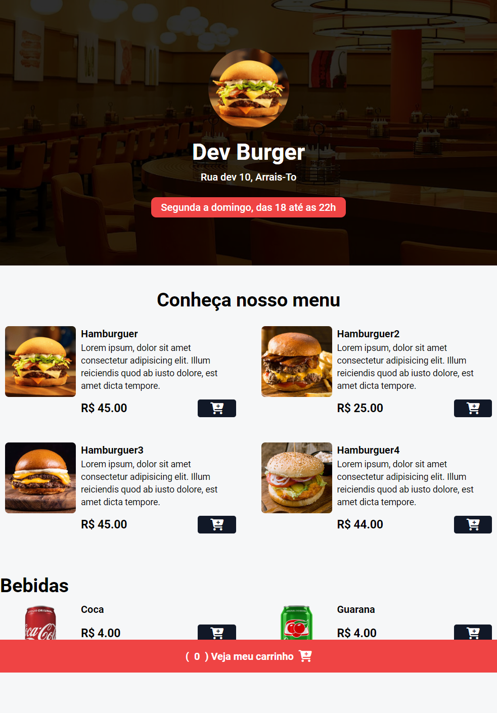

# DEV BURGUER

## Projeto de cardapio online para uma haburgueria, onde o usuário escolhe o que quer e, ao concluir, ele é redirecionado para o WhatsApp com a mensagem do pedido já pronta.

## Tecnologias

```
html
css(Tailwind)
Javascript
```

Projeto criado com objetivo de aprimorar conhecimento das tecnologis. Feito atraves da aulas do YouTube do canal: Sujeito Programdor

## Como executar

Para executar o projeto você preciasa ter o Node JS instalado em sua maquina. Pirmeiro faça o clone/dowload deste repositorio para sua maquina, em seguida rode o comamando `npm install` para instalar as dependencias do Tailwind, Assim que concluir a instalação, rode o comando `npm run dev`. Pronto agora é só executar o index.html do root do projeto em seu navegador.

##

<div align="center"></div>

##

<div align="center"></div>
